Welcome to DateDelta's documentation!
=====================================

**DateDelta** is a Python library and command line tool for computing the
number of days between two dates.

Check out the :doc:`getting started<getting_started>` section for more
information, including how to :ref:`install<installation>` the project.

.. note::

   This project is under active development.

Contents
--------

.. toctree::

   getting_started
   usage
   api
